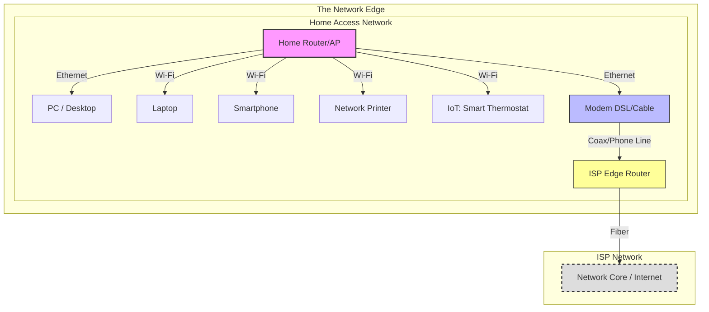

```mermaid
graph TD
    %% Define Nodes and Groups
    subgraph "The Network Edge"
        subgraph "Home Access Network"
            Router[Home Router/AP] -- Ethernet --> Desktop[PC / Desktop]
            Router -- Wi-Fi --> Laptop[Laptop]
            Router -- Wi-Fi --> Phone[Smartphone]
            Router -- Wi-Fi --> Printer[Network Printer]
            Router -- Wi-Fi --> IoT[IoT: Smart Thermostat]
            Modem[Modem DSL/Cable] -- Coax/Phone Line --> ISP_Edge[ISP Edge Router]
            Router -- Ethernet --> Modem
        end
    end

    subgraph "ISP Network"
        ISP_Edge -- Fiber --> Core[Network Core / Internet]
    end

    %% Apply Styles
    style Router fill:#f9f,stroke:#333,stroke-width:2px
    style Modem fill:#bbf,stroke:#333,stroke-width:1px
    style ISP_Edge fill:#ff9,stroke:#333,stroke-width:1px
    style Core fill:#ddd,stroke:#333,stroke-width:2px,stroke-dasharray: 5 5
```